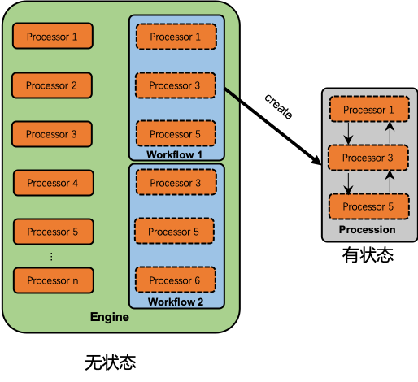

# U型框架说明文档
## 1. 概述
　　U型框架是一种将代码模块化，提高代码复用，实现高内聚、低耦合的一个代码框架。设计思想和常见的pipeline类似，在其基础上增加了方向的控制，数据流向不限于简单的单向流动，架构图如下：




　　本框架主要包含以下几个概念：

* **数据流**：在U型框架中，数据通过数据流的形式，在各个processor间流动，实现各种功能。
* **processor**：独立的处理单元，可以对数据流进行一种处理，是无状态的。
* **workflow**：一个具体任务的工作流，是一系列processor的组合，可以完成复杂的业务流程，是无状态的。
* **procession**：由workflow生成，用于执行具体的任务，对其中的processors进行管理，维护整个数据流向，是有状态的。

　　U型架构是一个垂直的链式结构，数据从Procession的顶端流入流出，流经其中的各个Processor，每个Processor处理完之后有up和down两种数据流向，默认的数据流向如Procession中的箭头所指，是一个u型的流向，这也是本框架命名的由来。除了默认的u型流向之外，也可以自定义数据流向，使Processor之间成环，构成一个状态机，实现更复杂的业务逻辑。

　　该架构的优点是在实现各种业务时，可以把复杂的树形结构(以往通常使用大量的if else实现各种复杂的业务逻辑)通过简单的链式结构实现。

## 2. 使用说明
### 2.1 安装
　　在使用该框架中的requirements.txt中增加

```
git+ssh://git@git.datagrand.com:58422/nlp/u_shape_framework.git@v0.2.0
```

　　或者直接pip install

```shell
pip install git+ssh://git@git.datagrand.com:58422/nlp/u_shape_framework.git@v0.2.0
```

　　@后面的为版本号，具体的版本信息可在[这里](https://git.datagrand.com/nlp/u_shape_framework/tags)查看。

### 2.2 配置文件
　　u型框架包含两个配置文件，均通过.py文件配置，分别是default配置文件，override配置文件。

#### 2.2.1 default配置文件

　　default配置文件需要有以下三个变量：

* **relative\_path\_to\_processor** / **absolute\_path\_to\_processor**:

	　　指定processor的路径，支持绝对路径与相对路径两种模式，两个都指定的情况下，优先使用绝对路径，若二者都不指定，则默认使用相对路径'..app.processors'。

	　　推荐使用相对路径，这样可以保证项目的顶层包不变，方便外挂脚本实现。

* **processor\_conf\_list**: 

	　　processor的配置项，是一个list。engine初始化时，会根据该配置实例化processor，每个processor实例通过一个字典进行配置，主要包括以下字段：
	* name：该实例的唯一标志符，workflow根据这个名字查找processor实例；
	* module：指向对应的processor模块，一个processor可以被实例化为多个processor实例。会根据该module名查找对应的类，映射规则如下：以Processor开头，然后将module以'_'分隔，且首字母大写，串联起来，代码看起来会更容易理解一点：

		```python
		if '.' in processor_module:
		    sub_package, short_module_name = processor_module.rsplit('.', 1)
		    module_name = 'processor_' + short_module_name
		    full_module_name = sub_package + '.' + module_name
		else:
		    module_name = 'processor_' + processor_module
		    full_module_name = module_name
		class_name = ''.join([c.capitalize() for c in module_name.split('_')])
		```
　　支持层次化调用，例如processors包底下有一个sub\_package,该包底下有个ProcessorDemoB,module设置为sub\_package.demo_b即可；
	* args：该processor实例的配置项，类型为字典；
	* type：processor的类型，支持两种，build_in和custom，分别对应框架内置的processor和自定义processor，默认值为custom；
	* comment：对该processor实例的说明，用以增加代码可读性。

* **workflow\_conf\_dict**:

	　　workflow的配置文件，是一个字典。engine初始化时，会根据该配置对processor实例进行组合，生成一系列的workflow。定义的结构比较简单：
	* key: workflow的名字，是该workflow的唯一标志符；
	* value: 由processor实例的name组成的list，表示该workflow由这些processor实例组成。
	
	下面是一个配置模块文件的例子：
	
	```python
	from u_shape_framework.build_in_processors import DEMO
	
	relative_path_to_processor = '..app.processors'
	
	processor_conf_list = [
	    DEMO,
	    {
	        "name": "demo_a",
	        "module": "demo_a",
	        "args": {}
	    },
	    {
	        "name": "demo_b",
	        "module": "sub_package.demo_b",
	        "args": {}
	    },
	]
	
	workflow_conf_dict = {
	    'demo': [
	        'demo',
	        'demo_a',
	        'demo_b',
	    ],
	    'test': [
	        'demo_a',
	    ]
	}
	
	```
#### 2.2.2 override配置文件

　　override配置文件支持两个参数，用以覆盖default中相应配置，实现差异化配置。其覆盖规则与docker-compose.override.yml相似：

* **processor\_conf\_list**: 

　　通过name字段匹配相应的processor配置，module字段无效，对应的args只会覆盖相应部分的差异。

* **workflow\_conf\_dict**:

	通过workflow的名字匹配相应的workflow，直接将整个workflow覆盖。
	
	例如，default配置如下：
	
	```python	
	relative_path_to_processor = '..app.processors'
	
	processor_conf_list = [
	    {
	        "name": "demo_a",
	        "module": "demo_a",
	        "args": {
	            'a': 1,
	            'b': 3,
	        }
	    },
	    {
	        "name": "demo_b",
	        "module": "sub_package.demo_b",
	        "args": {
	            'c': 5,
	            'd': 7,
	        }
	    },
	]
	
	workflow_conf_dict = {
	    'demo': [
	        'demo_a',
	        'demo_b',
	    ],
	}
	
	```
    override配置如下：
	
	```python	
	processor_conf_list = [
	    {
	        "name": "demo_a",
	        "args": {
	            'a': 2,
	        }
	    },
	    {
	        "name": "demo_b",
	        "args": {
	            'd': 8,
	        }
	    },
	]
	
	workflow_conf_dict = {
	    'demo': [
	        'demo_a',
	    ],
	}
	
	```
    
	那么最后生效的配置为
    
	```python	
	relative_path_to_processor = '..app.processors'
	
	processor_conf_list = [
	    {
	        "name": "demo_a",
	        "module": "demo_a",
	        "args": {
	            'a': 2,
	            'b': 3,
	        }
	    },
	    {
	        "name": "demo_b",
	        "module": "sub_package.demo_b",
	        "args": {
	            'c': 5,
	            'd': 8,
	        }
	    },
	]
	
	workflow_conf_dict = {
	    'demo': [
	        'demo_a',
	    ],
	}
	
	```

### 2.3 engine
　　框架中有一个全局engine，加载了processor和workflow等，先给出一个初始化engine的例子，以便有个直观认识：

```python
def init_engine():
    from u_shape_framework import set_logger
    from u_shape_framework.engine import initialize_engine, get_status, Status
    from project_demo.conf import u_shape_framework_conf

    set_logger(logger)

    if get_status() == Status.NotInitialized:
        override_conf_module_path = os.path.join(PROJECT_ROOT_PATH, 'project_demo/conf/custom_conf/override_conf')
        status = initialize_engine(u_shape_framework_conf, override_conf_module_path)
        assert status == Status.Success, 'engine initialize error'

```
　　下面来详细解释，在上述例子，主要调用了以下两个方法：

**set_logger(logger)**

　　框架中有一个全局的logger，通过该方法设置，若不设置，则默认为root。

**get_status()**

　　返回engine状态，有以下四种状态：

```python
class Status(object):
    NotInitialized = 'not_initialized'
    Initializing = 'initializing'
    Success = 'success'
    Failed = 'failed'
```
　　未初始化时，状态为NotInitialized；Initializing为正在初始化；Success为初始化正常；Failed为初始化失败。

**initialize\_engine(conf\_module, override\_conf\_module\_path=None, monitor\_mode='auto')**

* conf\_module:

	　　2.2中所述配置模块
* override\_conf\_module\_path:

	　　用于差异化配置模块的路径，会覆盖conf\_module中的对应配置。若不设置，则不会读取该配置，disable该功能。需要注意的是，在python中，模块是不带.py的，具体可参见下面的示例
* monitor\_mode:

	　　更新override\_conf\_module的方式，支持auto和manual两种方式，默认为auto。
	* auto 后台会启动一个Daemon线程，每隔1秒读取一次override\_conf\_module，有更新时立即更新engine。
	* manual 需要获取engine对象（通过get\_current\_engine()获取），调用update方法，例如

	```python
	from u_shape_framework.engine import get_current_engine
	get_current_engine().update()
	```
初始化engine可能是会耗时较长，初始化期间，engine状态为Initializing。正常初始化后，该函数返回Success状态。

### 2.4 运行
　　engine初始化完成后，便可以正常使用了，从engine中获取指定的workflow，给定request\_property(这个参数是这次请求的属性，包括了所有这次请求的输入)，运行这个生成workflow即可。

　　底层实现的时候，workflow会生成一个procession，然后运行这个procession。运行值得procession时，会生成空的tmp_\result和output，其中tmp_\result用于processor之间传递数据的中间结果，output存入这个workflow的输出。这么设定主要是从功能上区分开，实际使用时可以灵活调整，在满足需求的条件下，尽量提高代码可读性。

　　request\_property系统保留字段：run\_info。请不要在request\_property当中使用run_info字段，该字段为系统占用字段，随意修改会引起数据流混乱。

　　以下是一个简单的demo：

```python
from u_shape_framework.engine import get_current_engine


def run(request_property):
    # type (Dict) -> Dict
    workflow = get_current_engine().get_workflow('demo')
    output = workflow.run(request_property)
    return output
```

### 2.5 实现复杂数据流
　　默认的数据流向为u型，在概述中提到了，本框架也可支持更为复杂的环状数据流，以满足特定的需求。

　　实现方式很简单，数据流向是由各自的processor决定，在processor基类ProcessorBase中，有个direction\_controller,它提供了一个默认的流向控制器，它会将本次该processor实例的运行信息放入procession\_params中。

　　默认策略为：若未运行过，则指定流向为down，运行该processor的down方法，并在运行完毕后运行下面的processor；若该processor运行过，则指定流向为up，运行该processor的up方法，并在运行完毕后运行上面的processor。相关的代码如下：

```python
def direction_controller(self, tmp_result, output, request_property):
    if request_property['run_info'].get(self._name, False):
        return 'up'
    else:
        request_property['run_info'].update({self._name: True})
        return 'down'
```

　　如果希望实现更为复杂的逻辑，在对应的processor中覆写该方法即可。

### 2.6 Processor状态
　　所谓processor无状态，是指的不允许在Processor中出现会被修改的全局变量。因为在并发时，不同线程会同时修改该变量，引起混乱。在开发时，尽可能地将每次请求的状态存入input，output和procession\_params中。

　　若一定要在processor中加入会被修改的全局变量，可使用ThreadLocal，保证线程间独立。已在ProcessorBase中初始化，直接使用即可。例如：

```python
from u_shape_framework.processors.processor_base import ProcessorBase


class ProcessorDemo(ProcessorBase):

    def load(self, processor_args):
        pass

    def up(self, tmp_result, output, request_property):
        pass

    def down(self, tmp_result, output, request_property):
        self._thread_local.demo_var = request_property['request_id']
```
　　在这个例子中，即使不同线程对self._thread\_local进行修改，也不会相互冲突。